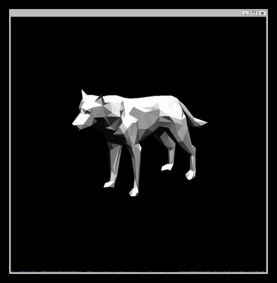

<div align="center">
  <a href="https://github.com/H-Wenfeng/MyRenderer">
    
  </a>

  <h1> :smiley_cat: Renderer</h1>

  <p>
 Aiming to build a pure self-made C++-based renderer.
  </p>
<div align="left">

<!--  -->

## Introductions :smiley_cat:

This project aims to document my self-learning journey in Computer Graphics and improve it further in the future. One of the main goals is to ensure that all important code blocks are accompanied by detailed annotations for better understanding. Additionally, I will strive to add more functions and reproduce interesting papers using this renderer.
## Features :smile_cat:
<div align="left">
  <table rules="none">
    <tr>
      <td>
        <p>* Shader Based</p>
        <p>* Flat Shading</p>
        <p>* Gouraud Shading</p>
        <p>* Blinn-Phong Shading</p>
        <p>* Depth Testing</p>
        <p>* Normal Mapping</p>
        <p>* Tangent Space Normal Mapping</p>
        <p>* Shadow Mapping</p>
        <p>* X11 + Keyboard-based Camera/Light control</p>
      </td>
      <td style="vertical-align: top;"><center></center></td>
      <td style="vertical-align: top;"><center></center></td>
    </tr>
    <tr>
      <td>
        <p>* RayTracer ! (I love Pink Floyd :)</p>
      </td>
      <td colspan="2"><center></center></td>
    </tr>
  </table>
</div>


## Usage :computer:
This project is powered by WSL2 with Ubuntu 20.04.

```
sudo apt install gcc libx11-dev
make ./main
```

```
Press W A S D I K to control the camera.
Press 8 2 4 6 + - to control the light.
```

## Todo :muscle:

- [ ] Orbital Camera
- [ ] UI
- [ ] Antialiasing
- [ ] Back-face culling
- [ ] Skybox
- [ ] Ray-tracing for Rasterizer
- [ ] ……


## Reference :notebook_with_decorative_cover:
https://nostarch.com/computer-graphics-scratch

https://learnopengl.com/

https://github.com/ssloy/tinyrenderer
